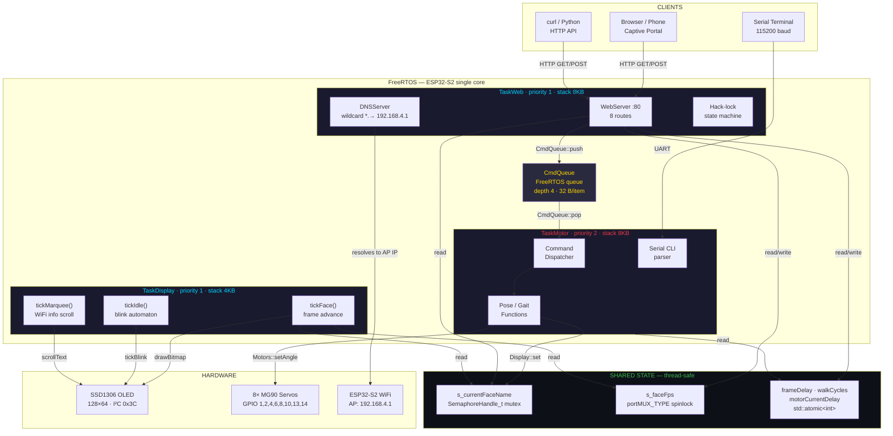
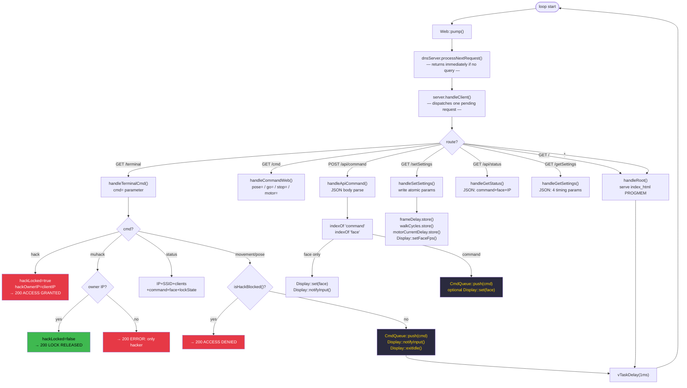
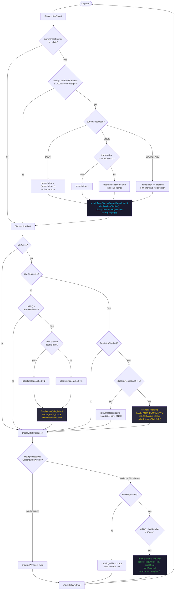
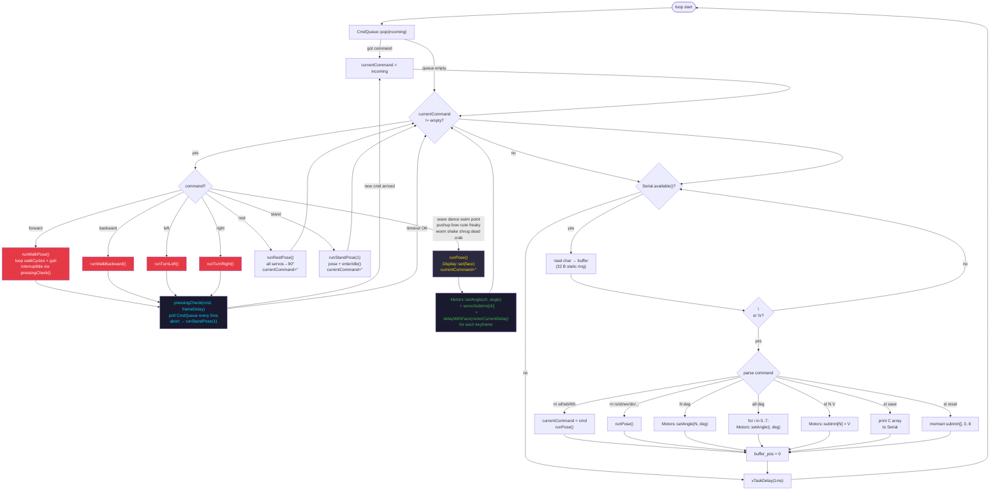

# SESAME MUHACK

<div align="center">

```
 ____  _____ ____    _    __  __ _____   __  __ _   _ _   _    _    ____ _  __
/ ___|| ____/ ___|  / \  |  \/  | ____| |  \/  | | | | | | |  / \  / ___| |/ /
\___ \|  _| \___ \ / _ \ | |\/| |  _|   | |\/| | | | | |_| | / _ \| |   | ' /
 ___) | |___ ___) / ___ \| |  | | |___  | |  | | |_| |  _  |/ ___ \ |___| . \
|____/|_____|____/_/   \_\_|  |_|_____| |_|  |_|\___/|_| |_/_/   \_\____|_|\_\
```

**quadruped · networked · slightly dangerous**

[](https://platformio.org)
[](https://www.espressif.com/en/products/socs/esp32-s2)
[](https://www.freertos.org)
[](platformio.ini)
[](https://muhack.org)

Fork of **[dorianborian/sesame-robot](https://github.com/dorianborian/sesame-robot)** · hacked by **[MuHack Brescia](https://muhack.org)**

</div>

---

## WHAT IT IS

8-servo ESP32-S2 quadruped robot with OLED face display, WiFi captive portal, browser terminal, and FreeRTOS multitasking. Point a phone at the AP, own the robot.

The mechanical design, movement algorithms, and face animation system are all by [Dorian Todd](https://github.com/dorianborian). MuHack took the firmware and refactored it.

---

## WHAT MUHACK ADDED

|                          |                                                                                      |
| ------------------------ | ------------------------------------------------------------------------------------ |
| **PlatformIO**           | Professional build system. No Arduino IDE. `pio run --target upload` and done.       |
| **FreeRTOS tasks**       | Three concurrent tasks: TaskWeb / TaskDisplay / TaskMotor. No more cooperative loop. |
| **Modular architecture** | 6-phase refactor: motors / display / web / core split into proper modules.           |
| **Thread-safe state**    | `std::atomic<int>` + `SemaphoreHandle_t` mutex + `portMUX_TYPE` spinlock.            |
| **Command queue**        | FreeRTOS queue decouples HTTP handlers from motor execution.                         |
| **Browser terminal**     | Web CLI — type commands directly from the captive portal.                            |
| **Hack lock**            | `hack` locks the robot to your IP. `muhack` releases it.                             |
| **Huge app partition**   | Dropped dual-OTA scheme. Flash usage: 71.6% → **29.8%**.                             |

---

## FLASH IT

```bash
git clone https://github.com/Stregatto888/Sesame_MuHack.git
cd Sesame_MuHack
pio run --target upload
pio device monitor
```

> Requires [PlatformIO Core](https://platformio.org/install/cli) and a USB cable.  
> External 5V ≥ 2A power supply needed for the servos.

---

## CONNECT

1. Join WiFi: **`Sesame MuHack`** · password: `12345678`
2. Browser auto-opens captive portal — or navigate to `http://192.168.4.1`
3. _(Optional)_ Connect robot to your LAN: set `NETWORK_SSID` / `NETWORK_PASS` in [include/core/config.h](include/core/config.h) → access at `http://sesame-robot.local`

---

## HTTP API

| Method | Route                         | What it does                                                     |
| ------ | ----------------------------- | ---------------------------------------------------------------- |
| `GET`  | `/cmd?go=forward`             | Walk forward (continuous until stopped)                          |
| `GET`  | `/cmd?go=backward`            | Walk backward                                                    |
| `GET`  | `/cmd?go=left`                | Turn left                                                        |
| `GET`  | `/cmd?go=right`               | Turn right                                                       |
| `GET`  | `/cmd?pose=dance`             | Execute a one-shot pose                                          |
| `GET`  | `/cmd?stop=1`                 | Stop all motion                                                  |
| `GET`  | `/cmd?motor=R1&value=135`     | Drive one servo directly                                         |
| `POST` | `/api/command`                | JSON body: `{"command":"wave","face":"happy"}`                   |
| `GET`  | `/api/status`                 | JSON: current command, face, IP, lock state                      |
| `GET`  | `/terminal?cmd=status`        | Browser terminal endpoint                                        |
| `GET`  | `/getSettings`                | JSON: `frameDelay`, `walkCycles`, `motorCurrentDelay`, `faceFps` |
| `GET`  | `/setSettings?frameDelay=150` | Update runtime params                                            |

**Examples:**

```bash
# Walk forward
curl "http://192.168.4.1/cmd?go=forward"

# Dance with a happy face
curl -X POST http://192.168.4.1/api/command \
  -H "Content-Type: application/json" \
  -d '{"command":"dance","face":"happy"}'

# Get robot status
curl http://192.168.4.1/api/status
```

---

## TERMINAL COMMANDS

Open the web UI → terminal tab, or `GET /terminal?cmd=<command>`:

| Command                                                             | Effect                                                              |
| ------------------------------------------------------------------- | ------------------------------------------------------------------- |
| `forward` / `backward` / `left` / `right`                           | Move                                                                |
| `stop`                                                              | Stop all motion                                                     |
| `rest` `stand` `wave` `dance` `swim` `point`                        | Poses                                                               |
| `pushup` `bow` `cute` `freaky` `worm` `shake` `shrug` `dead` `crab` | More poses                                                          |
| `status`                                                            | Show IP, SSID, connected clients, current command, face, lock state |
| `help`                                                              | List all commands                                                   |
| `hack`                                                              | Lock robot to your IP — other clients get ACCESS DENIED             |
| `muhack`                                                            | Release lock (owner IP only)                                        |

---

## FACES

37 face animations across three categories:

```
── MOVEMENT ─────────────────────────────────────────────────────────
  walk  rest  swim  dance  wave  point  stand

── POSES ────────────────────────────────────────────────────────────
  cute  pushup  freaky  bow  worm  shake  shrug  dead  crab

── IDLE ─────────────────────────────────────────────────────────────
  idle  idle_blink  defualt

── EMOTIONS (+ talking variants for voice assistant integration) ─────
  happy      talk_happy    sad        talk_sad      angry      talk_angry
  surprised  talk_surprised  sleepy   talk_sleepy   love       talk_love
  excited    talk_excited  confused   talk_confused  thinking  talk_thinking
```

Set a face independently of movement:

```bash
curl -X POST http://192.168.4.1/api/command \
  -d '{"face":"thinking"}'
```

---

## HARDWARE

| Component    | Detail                                               |
| ------------ | ---------------------------------------------------- |
| MCU          | Lolin S2 Mini (ESP32-S2, 240 MHz, single core)       |
| Display      | SSD1306 128×64 OLED · I²C SDA=GPIO 35, SCL=GPIO 33   |
| Servos       | 8× MG90 · GPIO {1, 2, 4, 6, 8, 10, 13, 14}           |
| Leg topology | R1/R2/L1/L2 = hip servos · R3/R4/L3/L4 = foot servos |
| Power        | 5V ≥ 2A external (USB-C PD or bench supply)          |
| Flash        | 4 MB · huge_app partition · 938 KB used (29.8%)      |
| RAM          | 320 KB · 56 KB used (17.0%)                          |

---

## ARCHITECTURE

### System Overview



---

### TaskWeb — detail



---

### TaskDisplay — detail



---

### TaskMotor — detail



**Thread-safety contracts:**

| Shared variable                                 | Mechanism                 |
| ----------------------------------------------- | ------------------------- |
| Face name (`String`)                            | `SemaphoreHandle_t` mutex |
| Face FPS (`int`)                                | `portMUX_TYPE` spinlock   |
| `frameDelay`, `walkCycles`, `motorCurrentDelay` | `std::atomic<int>`        |

---

## SERIAL CLI

115200 baud. Connect with `pio device monitor`.

| Command                                                 | Effect                                             |
| ------------------------------------------------------- | -------------------------------------------------- |
| `rn wf` / `rn wb` / `rn tl` / `rn tr`                   | Walk fwd/bwd/left/right                            |
| `rn rs` / `rn st`                                       | Rest / stand                                       |
| `rn wv` `rn dn` `rn sw` `rn pt` `rn pu` `rn bw`         | Wave / dance / swim / point / pushup / bow         |
| `rn ct` `rn fk` `rn wm` `rn sk` `rn sg` `rn dd` `rn cb` | Cute / freaky / worm / shake / shrug / dead / crab |
| `<n> <deg>`                                             | Set servo n (0–7) to angle                         |
| `all <deg>`                                             | Set all 8 servos to same angle                     |
| `st <n> <v>`                                            | Set subtrim offset for servo n                     |
| `st save`                                               | Print subtrim C array to paste into source         |
| `st reset`                                              | Zero all subtrims                                  |

---

## CREDITS

**Original project — [Sesame Robot by Dorian Todd](https://github.com/dorianborian/sesame-robot)**  
All core movement algorithms, servo kinematics, face animation system, and hardware design are Dorian's work. This fork builds on his foundation — go star the original.

**MuHack Brescia Edition** — [muhack.org](https://muhack.org)  
PlatformIO migration, FreeRTOS refactor (6 phases), web terminal, hack lock, MuHack branding.

**Libraries**  
[ESP32Servo](https://github.com/madhephaestus/ESP32Servo) by Kevin Harrington ·
[Adafruit SSD1306](https://github.com/adafruit/Adafruit_SSD1306) ·
[Adafruit GFX](https://github.com/adafruit/Adafruit-GFX-Library) ·
ESP32 Arduino Core by Espressif Systems

---

<div align="center">

**Made with ❤️ and ⚡ at [MuHack Brescia](https://muhack.org)**

_Issues and PRs welcome._

</div>
