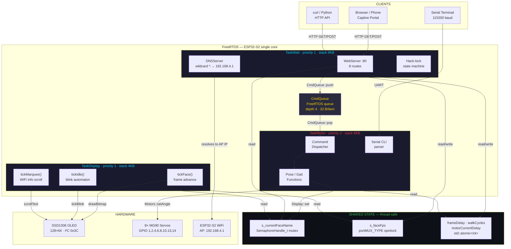

# Architecture — System Overview

All three FreeRTOS tasks, the command queue, hardware peripherals, client interfaces, and shared thread-safe state.

## Thread-safety contracts

| Shared variable                                       | Writers                    | Readers                   | Mechanism                 |
| ----------------------------------------------------- | -------------------------- | ------------------------- | ------------------------- |
| `s_currentFaceName` (String)                          | TaskMotor (`Display::set`) | TaskWeb (status/terminal) | `SemaphoreHandle_t` mutex |
| `s_faceFps` (int)                                     | TaskWeb (`setSettings`)    | TaskDisplay (`tickFace`)  | `portMUX_TYPE` spinlock   |
| `frameDelay`, `walkCycles`, `motorCurrentDelay` (int) | TaskWeb (`setSettings`)    | TaskMotor (poses, servo)  | `std::atomic<int>`        |
| `CmdQueue`                                            | TaskWeb (HTTP handlers)    | TaskMotor (dispatcher)    | FreeRTOS queue (ISR-safe) |

## Related diagrams

- [TaskWeb detail](../Web/task-web.md)
- [TaskDisplay detail](../Display/task-display.md)
- [TaskMotor detail](../Motor/task-motor.md)
