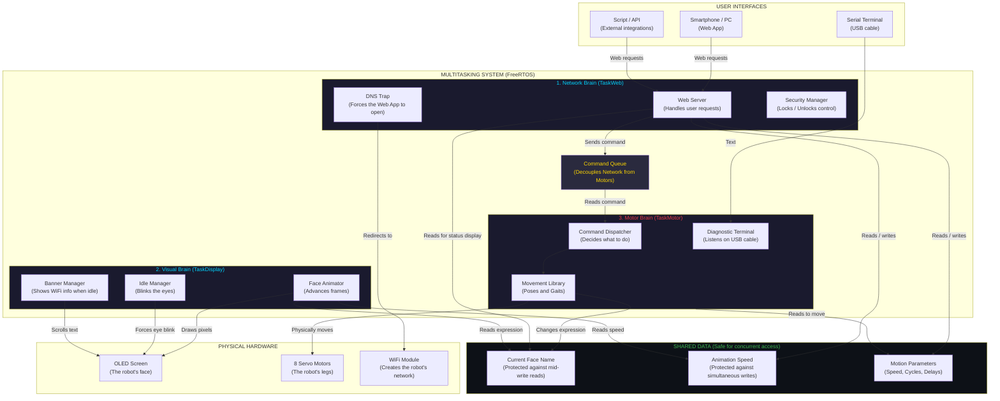

# Architecture — How It Works

All three FreeRTOS tasks, the command queue, the physical hardware, the user interfaces, and the shared data with thread protection.

## Shared data safety

Three tasks run in parallel and read/write the same data.
To avoid corruption, each shared variable is protected by a different mechanism:

| Shared variable | Who writes | Who reads | Protection used |
| --- | --- | --- | --- |
| Current face name (`String`) | TaskMotor (`Display::set`) | TaskWeb (status/terminal) | Mutex (`SemaphoreHandle_t`) |
| Animation speed (`int`) | TaskWeb (`setSettings`) | TaskDisplay (`tickFace`) | Spinlock (`portMUX_TYPE`) |
| `frameDelay`, `walkCycles`, `motorCurrentDelay` (`int`) | TaskWeb (`setSettings`) | TaskMotor (poses, servo) | Atomic variable (`std::atomic<int>`) |
| Command queue (`CmdQueue`) | TaskWeb (HTTP handlers) | TaskMotor (dispatcher) | FreeRTOS queue (interrupt-safe) |

## Related diagrams

- [TaskWeb — How It Works](../Web/web4stupid.md)
- [TaskDisplay — How It Works](../Display/display4stupid.md)
- [TaskMotor — How It Works](../Motor/motor4stupid.md)
