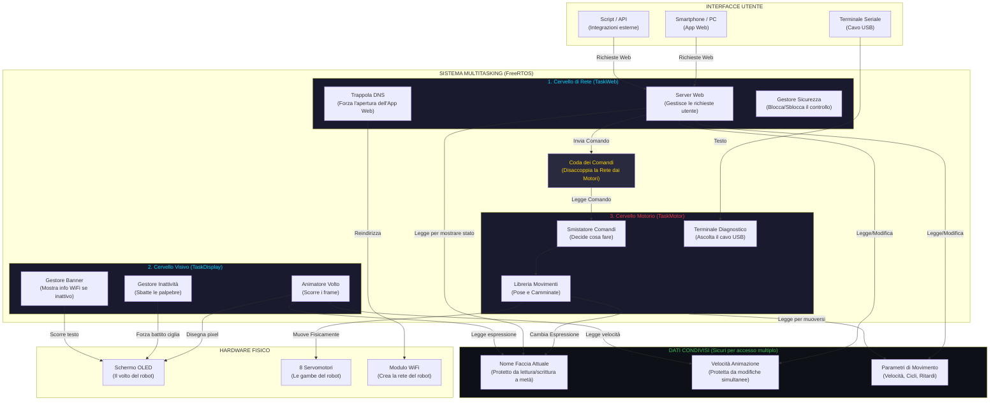

# Architettura — Panoramica del Sistema

Tutti e tre i task FreeRTOS, la coda dei comandi, i dispositivi fisici, le interfacce utente e i dati condivisi con protezione thread.

## Sicurezza degli accessi condivisi

Tre task diversi girano in parallelo e leggono/scrivono gli stessi dati.
Per non corrompere le informazioni, ogni variabile condivisa è protetta da un meccanismo diverso:

| Variabile condivisa | Chi scrive | Chi legge | Protezione usata |
| --- | --- | --- | --- |
| Nome faccia attuale (`String`) | TaskMotor (`Display::set`) | TaskWeb (stato/terminale) | Mutex (`SemaphoreHandle_t`) |
| Velocità animazione (`int`) | TaskWeb (`setSettings`) | TaskDisplay (`tickFace`) | Spinlock (`portMUX_TYPE`) |
| `frameDelay`, `walkCycles`, `motorCurrentDelay` (`int`) | TaskWeb (`setSettings`) | TaskMotor (pose, servo) | Variabile atomica (`std::atomic<int>`) |
| Coda comandi (`CmdQueue`) | TaskWeb (handler HTTP) | TaskMotor (dispatcher) | Coda FreeRTOS (sicura da interrupt) |

## Diagrammi correlati

- [TaskWeb — Come Funziona](../Web/web4stupid.md)
- [TaskDisplay — Come Funziona](../Display/display4stupid.md)
- [TaskMotor — Come Funziona](../Motor/motor4stupid.md)
