# TaskDisplay — Come Funziona

**Priorità:** 1 · **Stack:** 4 KB · **Ciclo:** ogni 10 ms

Controlla lo schermo OLED. Ad ogni ciclo esegue tre funzioni in sequenza: scorre i fotogrammi della faccia, gestisce il battito di ciglia automatico, e fa scorrere il banner WiFi quando il robot è inattivo.

```mermaid
flowchart TD
START([Inizio Ciclo Schermo]) --> TF["Fase 1: Animazione Faccia\n(Scorre i fotogrammi)"]

    TF --> CHKFRAMES{"La faccia richiesta\nha dei fotogrammi?"}
    CHKFRAMES -->|No| TI
    CHKFRAMES -->|Sì| ELAPSED{"È passato abbastanza\ntempo per il frame successivo?\n(In base agli FPS)"}
    ELAPSED -->|No, aspetta| TI
    ELAPSED -->|Sì| MODE{Regola di\nRiproduzione?}

    MODE -->|Ciclo Infinito| LOOP_ADV["Avanza al prossimo.\nSe finisce, ricomincia da capo."]
    MODE -->|Solo una volta| ONCE_CHECK{"Sono all'ultimo fotogramma?"}
    ONCE_CHECK -->|No| ONCE_ADV["Avanza al prossimo"]
    ONCE_CHECK -->|Sì| ONCE_FREEZE["Segna animazione finita\n(Rimani fermo sull'ultimo)"]
    MODE -->|Avanti e Indietro| BOOM_ADV["Avanza. Se tocchi la fine,\ninizia ad andare all'indietro."]

    LOOP_ADV --> DRAW
    ONCE_ADV --> DRAW
    ONCE_FREEZE --> DRAW
    BOOM_ADV --> DRAW

    DRAW["Aggiorna Schermo OLED\n(Disegna i nuovi 128x64 pixel)"] --> TI

    TI["Fase 2: Gestione Inattività\n(Rende il robot vivo)"] --> IDLE_CHK{"Il robot è fermo\nin attesa (Stand)?"}
    IDLE_CHK -->|No| TM
    IDLE_CHK -->|Sì| BLINK_CHK{"Sta già sbattendo\nle palpebre?"}

    BLINK_CHK -->|No| SCHED_CHK{"È ora di fare un\nbattito di ciglia casuale?"}
    SCHED_CHK -->|No| TM
    SCHED_CHK -->|Sì| DBLCHK{"Probabilità del 30%\ndi fare un doppio battito"}
    DBLCHK -->|Sì| DOUBLE["Imposta 2 battiti"]
    DBLCHK -->|No| SINGLE["Imposta 1 battito"]
    DOUBLE --> START_BLINK
    SINGLE --> START_BLINK["Forza espressione 'battito'\n(Eseguita una sola volta)"]

    BLINK_CHK -->|Sì| FIN_CHK{"Ha finito di sbattere\nle palpebre?"}
    FIN_CHK -->|No| TM
    FIN_CHK -->|Sì| REPEAT_CHK{"Doveva fare un\ndoppio battito?"}
    REPEAT_CHK -->|Sì| START_BLINK2["Rifai il battito di ciglia"]
    REPEAT_CHK -->|No| RETURN_IDLE["Torna alla faccia normale\nDecidi casualmente tra quanti\nsecondi (3-7s) farlo di nuovo"]

    START_BLINK --> TM
    START_BLINK2 --> TM
    RETURN_IDLE --> TM

    TM["Fase 3: Gestione Banner\n(Mostra info WiFI)"] --> WIFI_CHK{"È stato premuto un tasto\ndi recente?"}
    WIFI_CHK -->|Sì, utente attivo| HIDE["Nascondi testo WiFi"]
    WIFI_CHK -->|No, inattivo da 30s| SHOW_CHK{"Il banner è\ngià visibile?"}
    SHOW_CHK -->|No| ACTIVATE["Mostralo e\nfallo partire da destra"]
    SHOW_CHK -->|Sì| SCROLL_CHK{"È ora di spostare il\ntesto di un pixel?"}
    SCROLL_CHK -->|Sì| SCROLL["Disegna rettangolo nero\nScrivi testo spostato a sinistra\nSe finisce, ricomincia"]

    HIDE --> DELAY
    ACTIVATE --> DELAY
    SCROLL --> DELAY["Riposo breve (10ms)"]
    DELAY --> START

    style DRAW fill:#1a1a2e,color:#00d4ff
    style START_BLINK fill:#2a2a3e,color:#ffd700
    style RETURN_IDLE fill:#2a2a3e,color:#ffd700
    style SCROLL fill:#1a1a2e,color:#3fb950
```

## Modalità di riproduzione dell'animazione

| Modalità | Comportamento | Quando si usa |
| --- | --- | --- |
| **Ciclo Infinito** (`LOOP`) | Scorre i frame 0→N→0→N all'infinito | Camminate, danze continue |
| **Una Volta** (`ONCE`) | Riproduce 0→N, si ferma sull'ultimo frame e segnala "finito" | Battito di ciglia, pose singole |
| **Avanti e Indietro** (`BOOMERANG`) | Va 0→N→0, inverte direzione ai bordi | Riposo, idle, point |

## Tempi del battito di ciglia

- **Intervallo tra un battito e l'altro:** casuale, tra 3 e 7 secondi
- **Probabilità doppio battito:** 30%
- **FPS dell'animazione battito:** 7 fotogrammi al secondo
- **Ritorno alla faccia normale:** appena l'animazione segna "finita"

## Diagrammi correlati

- [Panoramica Sistema](../Architecture/architecture4stupid.md)
- [TaskWeb — Come Funziona](../Web/web4stupid.md)
- [TaskMotor — Come Funziona](../Motor/motor4stupid.md)
