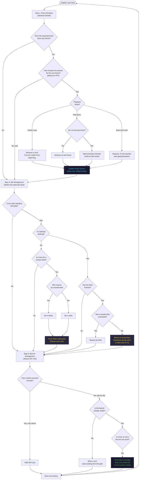

# TaskDisplay — How It Works

**Priority:** 1 · **Stack:** 4 KB · **Loop period:** every 10 ms

Controls the OLED screen. Each loop it runs three functions in sequence: advance the face animation frames, handle the automatic eye blink, and scroll the WiFi banner when the robot is idle.

## Animation playback modes

| Mode | Behaviour | When it's used |
| --- | --- | --- |
| **Infinite Loop** (`LOOP`) | Cycles frames 0→N→0→N forever | Continuous gaits, dances |
| **Play Once** (`ONCE`) | Plays 0→N, freezes on last frame, marks "finished" | Eye blink, single poses |
| **Back and Forth** (`BOOMERANG`) | Ping-pongs 0→N→0, reverses at boundaries | Rest, idle, point |

## Eye blink timing

- **Interval between blinks:** random, between 3 and 7 seconds
- **Double-blink probability:** 30%
- **Blink animation FPS:** 7 frames per second
- **Return to normal face:** immediately after animation marks "finished"

## Related diagrams

- [System Overview](../Architecture/architecture4stupid.md)
- [TaskWeb — How It Works](../Web/web4stupid.md)
- [TaskMotor — How It Works](../Motor/motor4stupid.md)
