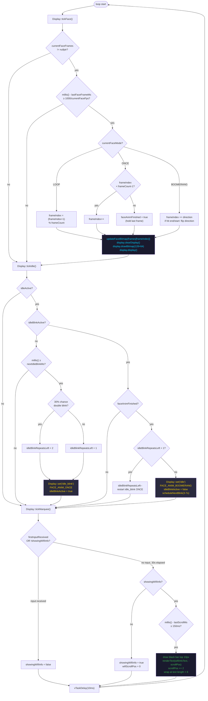

# TaskDisplay — Detail

**Priority:** 1 · **Stack:** 4 KB · **Loop period:** 10 ms

Owns the OLED. Runs three independent tick functions each loop: face frame advance, idle-blink state machine, and WiFi info marquee scroll.

## Animation modes

| Mode                  | Behaviour                                                      | Typical use                    |
| --------------------- | -------------------------------------------------------------- | ------------------------------ |
| `FACE_ANIM_LOOP`      | Cycles frames 0→N→0→N forever                                  | Continuous gaits (walk, dance) |
| `FACE_ANIM_ONCE`      | Plays 0→N, freezes on last frame, sets `faceAnimFinished=true` | One-shot poses, idle_blink     |
| `FACE_ANIM_BOOMERANG` | Ping-pong 0→N→0, direction flips at boundaries                 | Rest, idle, point              |

## Idle-blink timing

- **Blink interval:** random 3–7 s
- **Double-blink probability:** 30%
- **Frame rate of idle_blink:** 7 FPS (from per-face FPS table)
- **Return to idle:** immediately after `faceAnimFinished` is set

## Related diagrams

- [System overview](../Architecture/architecture-overview.md)
- [TaskWeb detail](../Web/task-web.md)
- [TaskMotor detail](../Motor/task-motor.md)
