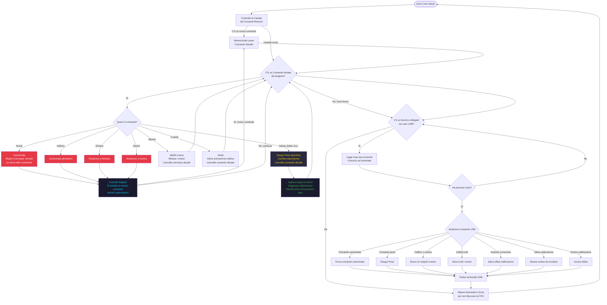

# TaskMotor — Come Funziona

**Priorità:** 2 (la più alta) · **Stack:** 8 KB · **Ciclo:** ogni ~1 ms

Il task più importante. Prende i comandi dalla coda e li esegue: camminate, pose, e movimenti diretti via cavo USB. La priorità più alta garantisce che i motori rispondano subito.



## Interruzione durante la camminata

Le camminate (avanti/indietro/sinistra/destra) si possono interrompere in qualsiasi momento. Ogni 5 ms durante il ciclo di passo, `pressingCheck()` controlla se è arrivato un nuovo comando. Se sì:

1. Il nuovo comando diventa quello attuale
2. Il robot torna in posizione sicura (`runStandPose`)
3. La camminata si interrompe subito

## Come viene mosso un servo

```
angolo_richiesto
  + servoSubtrim[canale]          ← offset di calibrazione int8_t [-90, +90]
  = constrain(risultato, 0, 180)
  → servos[canale].write()
  → vTaskDelay(motorCurrentDelay) ← ritardo per distribuire il picco di corrente
```

## Comandi continui vs. pose singole

| Tipo | Comandi | Comportamento |
| --- | --- | --- |
| **Continui** | avanti, indietro, sinistra, destra | Il comando rimane attivo e si riavvia ogni ciclo finché non viene interrotto |
| **Pose singole** | rest, stand, wave, dance, ecc. | La funzione cancella il comando attuale quando ha finito |

## Diagrammi correlati

- [Panoramica Sistema](../Architecture/architecture4stupid.md)
- [TaskWeb — Come Funziona](../Web/web4stupid.md)
- [TaskDisplay — Come Funziona](../Display/display4stupid.md)
