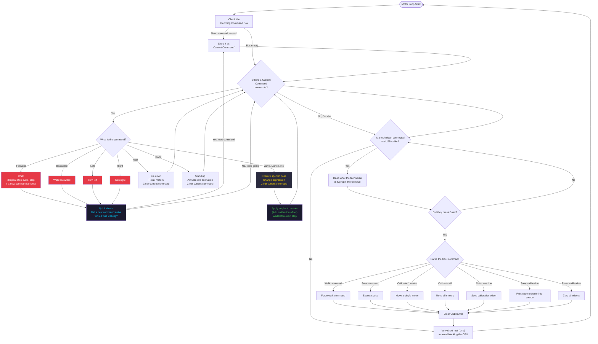

# TaskMotor — How It Works

**Priority:** 2 (the highest) · **Stack:** 8 KB · **Loop period:** every ~1 ms

The most important task. Picks commands from the queue and executes them: walks, poses, and direct movements via USB cable. The highest priority ensures motors respond immediately.



## Interrupting a walk

Walk commands (forward/backward/left/right) can be interrupted at any time. Every 5 ms during the step cycle, `pressingCheck()` checks if a new command has arrived. If so:

1. The new command becomes the current one
2. The robot returns to a safe position (`runStandPose`)
3. The walk loop stops immediately

## How a servo is moved

```
requested_angle
  + servoSubtrim[channel]         ← calibration offset int8_t [-90, +90]
  = constrain(result, 0, 180)
  → servos[channel].write()
  → vTaskDelay(motorCurrentDelay) ← delay to spread inrush current
```

## Continuous vs. one-shot commands

| Type | Commands | Behaviour |
| --- | --- | --- |
| **Continuous** | forward, backward, left, right | Command stays active and re-dispatches every loop until interrupted |
| **One-shot** | rest, stand, wave, dance, etc. | Function clears the current command on completion |

## Related diagrams

- [System Overview](../Architecture/architecture4stupid.md)
- [TaskWeb — How It Works](../Web/web4stupid.md)
- [TaskDisplay — How It Works](../Display/display4stupid.md)
