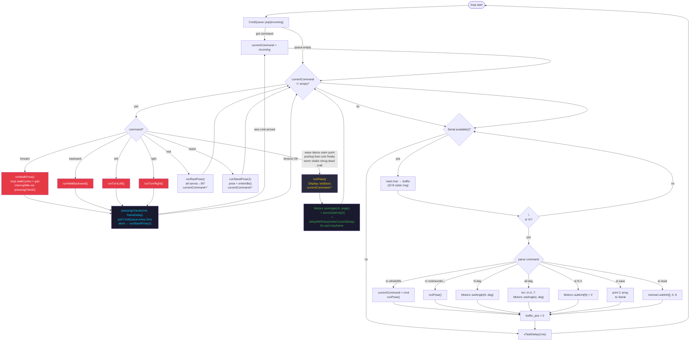

# TaskMotor — Detail

**Priority:** 2 · **Stack:** 8 KB · **Loop period:** ~1 ms

Highest-priority task. Pops commands from CmdQueue and dispatches them to pose/gait functions. Also owns the Serial CLI parser for direct hardware access.



## pressingCheck() — interruptible gait

Locomotion commands (forward/backward/left/right) are interruptible. During every inter-frame pause, `pressingCheck()` polls CmdQueue every 5 ms. If a new command arrives:

1. `currentCommand = newCmd`
2. `runStandPose(1)` — safe park position
3. Returns `false` — caller aborts the gait loop immediately

## Motors::setAngle() — per-channel pipeline

```
angle_requested
  + servoSubtrim[channel]         ← int8_t offset [-90, +90]
  = constrain(result, 0, 180)
  → servos[channel].write()
  → vTaskDelay(motorCurrentDelay) ← spread inrush current
```

## Continuous vs one-shot commands

| Type           | Commands                         | Behaviour                                                              |
| -------------- | -------------------------------- | ---------------------------------------------------------------------- |
| **Continuous** | forward, backward, left, right   | `currentCommand` stays set; re-dispatches every loop until interrupted |
| **One-shot**   | all poses (rest, stand, wave, …) | Function clears `currentCommand` itself on completion                  |

## Related diagrams

- [System overview](architecture-overview.md)
- [TaskWeb detail](task-web.md)
- [TaskDisplay detail](task-display.md)
