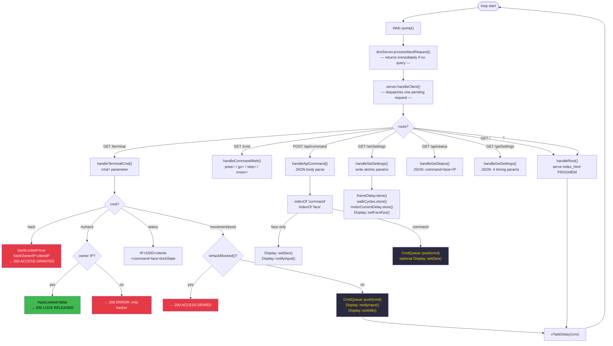

# TaskWeb — Detail

**Priority:** 1 · **Stack:** 8 KB · **Loop period:** ~1 ms

Owns the DNS captive-portal server and the HTTP server. All 8 routes are dispatched here. The hack-lock state machine lives entirely inside this task.

## Hack-lock state machine

| State        | Trigger                     | Effect                                  |
| ------------ | --------------------------- | --------------------------------------- |
| **Unlocked** | —                           | Any client can push commands            |
| **Locked**   | `hack` from any client      | Only `hackOwnerIP` can push commands    |
| **Released** | `muhack` from `hackOwnerIP` | Back to unlocked                        |
| —            | `muhack` from non-owner     | `ERROR: only the hacker` — stays locked |

## Related diagrams

- [System overview](../Architecture/architecture-overview.md)
- [TaskDisplay detail](../Display/task-display.md)
- [TaskMotor detail](../Motor/task-motor.md)
