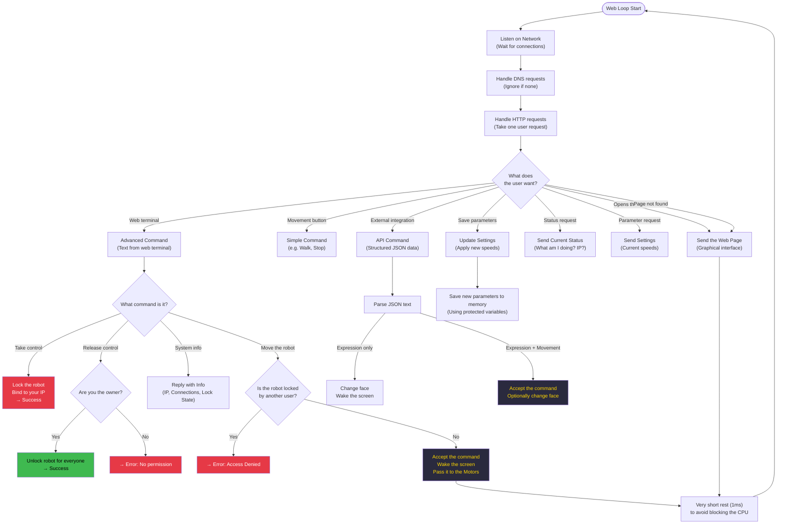

# TaskWeb — How It Works

**Priority:** 1 · **Stack:** 8 KB · **Loop period:** every ~1 ms

Manages the captive portal DNS server and the HTTP server. All 8 routes are handled here. The hack-lock mechanism lives entirely inside this task.

## Hack-lock state machine

Anyone connected to the robot's WiFi network can control it.
The `hack` command lets a single user take exclusive control:

| State | Trigger | Effect |
| --- | --- | --- |
| **Unlocked** | — (starting state) | Any client can send commands |
| **Locked** | `hack` from any client | Only the IP that sent `hack` can command the robot |
| **Released** | `muhack` from the owner IP | Back to unlocked for everyone |
| — | `muhack` from a non-owner IP | `ERROR: only the hacker can unlock` — stays locked |

## Related diagrams

- [System Overview](../Architecture/architecture4stupid.md)
- [TaskDisplay — How It Works](../Display/display4stupid.md)
- [TaskMotor — How It Works](../Motor/motor4stupid.md)
