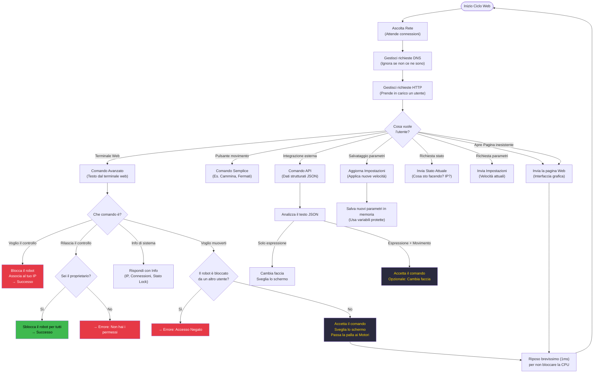

# TaskWeb — Come Funziona

**Priorità:** 1 · **Stack:** 8 KB · **Ciclo:** ogni ~1 ms

Gestisce il server DNS del portale captive e il server HTTP. Tutte le 8 rotte passano da qui. Il meccanismo di blocco "hack-lock" vive interamente in questo task.

## Macchina a stati del blocco (hack-lock)

Chiunque si connette alla rete WiFi del robot può controllarlo.
Il comando `hack` permette a un singolo utente di "prendersi" il controllo esclusivo:

| Stato | Come si attiva | Effetto |
| --- | --- | --- |
| **Sbloccato** | — (stato di partenza) | Qualsiasi client può inviare comandi |
| **Bloccato** | `hack` da qualsiasi client | Solo l'IP che ha lanciato `hack` può comandare |
| **Rilasciato** | `muhack` dall'IP proprietario | Torna sbloccato per tutti |
| — | `muhack` da un IP non proprietario | `ERRORE: solo l'hacker può sbloccare` — rimane bloccato |

## Diagrammi correlati

- [Panoramica Sistema](../Architecture/architecture4stupid.md)
- [TaskDisplay — Come Funziona](../Display/display4stupid.md)
- [TaskMotor — Come Funziona](../Motor/motor4stupid.md)
